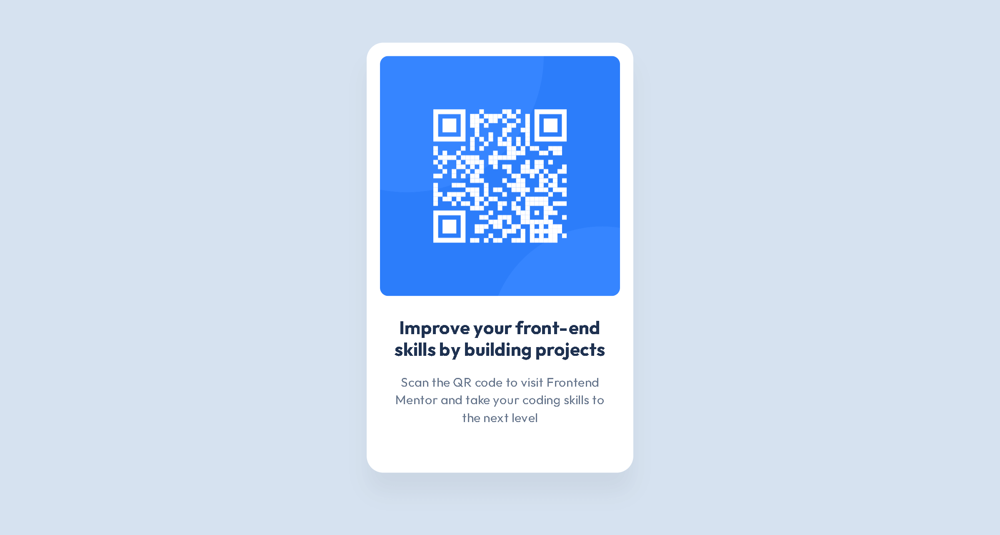

# QR code component

## 🚀 Demo

See **[Live Demo](https://yhycoder.github.io/qr-code-component-fm/)**

## 🖥️ Preview

|                                               Desktop                                                |                                               Mobile                                               |
| :--------------------------------------------------------------------------------------------------: | :------------------------------------------------------------------------------------------------: |
|  |  |

## 📝 About the project

This project is a solution to the "QR Code Component" challenge on [Frontend Mentor](https://www.frontendmentor.io/challenges/qr-code-component-iux_sIO_H).  
It focuses on building a clean, responsive component using semantic HTML and modern CSS practices while matching the provided design.

## 💡 Key learnings

- **Flexbox & Centering Mastery:** Achieved pixel-perfect **vertical and horizontal centering** of the entire component using **Flexbox**, demonstrating control over fundamental CSS layout principles.
- **Modern CSS Architecture:** Ensured maintainability and scalability by strictly adhering to the **BEM Naming Convention** and utilizing **CSS Variables** for consistent styling throughout the component.
- **Responsive Methodology:** Successfully implemented a **Mobile-First approach**, ensuring the design scales seamlessly and precisely matches the original specifications across all screen sizes.

## ⚙️ Quick Start

1- Clone Repository:

HTTPS:

```bash
git clone https://github.com/YhyCoder/qr-code-component-fm
```

SSH:

```bash
git clone git@github.com:YhyCoder/qr-code-component-fm.git
```

2- Run the Project:

Open `index.html` in your browser
